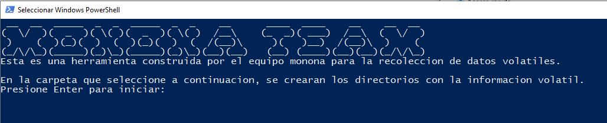
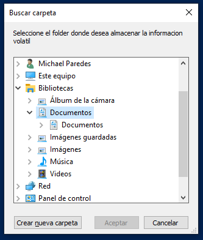
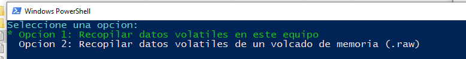
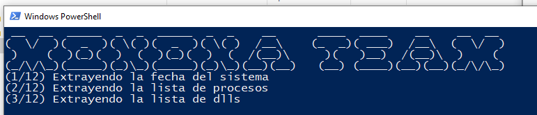
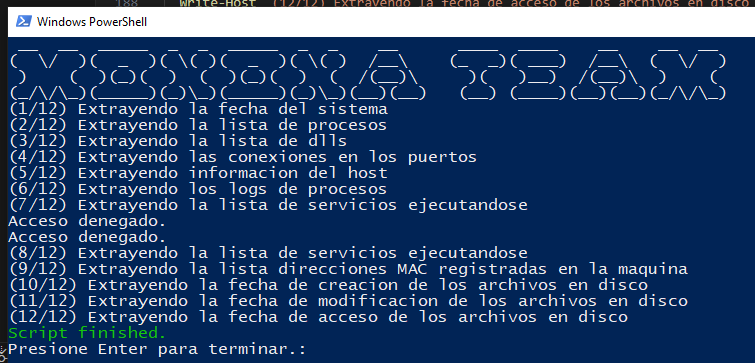

# volatile-data-win

# Introducción

Este proyecto tiene como objetivo recolectar datos volatiles de dos maneras:

1. Recolecta datos volatiles de la máquina en la cual se ejecuta
2. Recolecta datos de un volcado de memoria en formato .raw utilizando la herramienta volatility.

# Prerequisitos

- En el directorio donde se encuentre el script **monona.ps1**.
- Las herramientas de SysInternal deben está descomprimidas y en una carpeta llamada herramientas. Se pueden descargar desde [aquí](https://download.sysinternals.com/files/SysinternalsSuite.zip)

El arbol de directorio donde se encuentra el script **monona.ps1**, debe verse así

```
working_folder\
  | herramientas\
    | <all sysInternal tools>
  | monona.ps1
  | volatility.exe
```

# Cómo usarlo

Una vez configurados los archivos como se describe arriba, haga clic derecho sobre el script **monona.ps1** y ejecuté en PowerShell. Siga las instrucciones de la consola para recopilar los datos volátiles.









